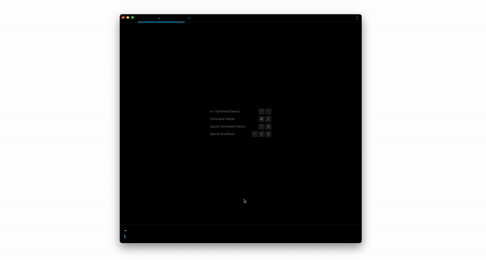
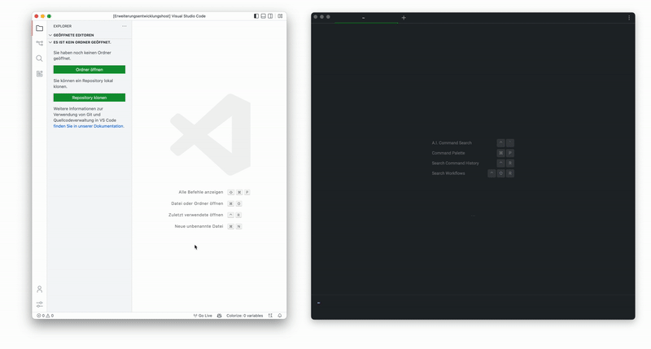
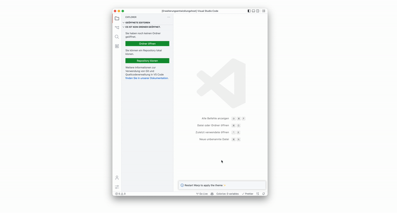

	
# Warp-Companion

**Warp-Companion** is an extension, which synchronizes your VS-Code Theme with [Warp](https://warp.dev/).

## How to use Warp-Companion

### Firstly select the generated theme in Warp

When installing the extension, it will automatically generate a `Vs Code` Theme for Warp. Open the Theme Picker from the Command Palette (⌘+P).

### Change your Theme in VS Code

After selecting your Theme in Warp, it will automatically synchronize with VS-Code. You need to restart Warp every time, you change your theme to see the Theme in effect.

## Issues

There currently is no native way, to get the theme colors in VS-Code. This extension uses a hack, which causes to lose the ability to preview themes with the `Up` and `Down` keys.

## Contact

[@torben_haack](https://twitter.com/torben_haack) – hi@warp-themes.com

---

### Have you heard about Warp-Themes?

Warp-Themes is a visual theme builder for Warp. Try it out now by clicking the image blow ✨

